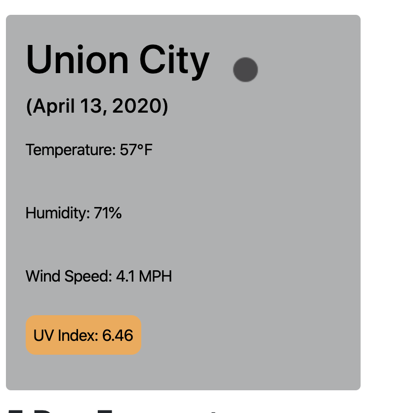

# Weather Dashboard

[Link to deployed project](https://sinchochan.github.io/06homework/)

## About the Project
This day planner was created with the intention of helping the user view current weather conditions, as well as the forecast for the 5 coming days. Users can also view past cities searched. The project utilizes HTML, CSS, JavaScript and third-party APIs such as Open Weather.

## User Story

```
AS A traveler
I WANT to see the weather outlook for multiple cities
SO THAT I can plan a trip accordingly
```

## Acceptance Criteria/ function

```
GIVEN a weather dashboard with form inputs
WHEN I search for a city
THEN I am presented with current and future conditions for that city and that city is added to the search history
WHEN I view current weather conditions for that city
THEN I am presented with the city name, the date, an icon representation of weather conditions, the temperature, the humidity, the wind speed, and the UV index
WHEN I view the UV index
THEN I am presented with a color that indicates whether the conditions are favorable, moderate, or severe
WHEN I view future weather conditions for that city
THEN I am presented with a 5-day forecast that displays the date, an icon representation of weather conditions, the temperature, and the humidity
WHEN I click on a city in the search history
THEN I am again presented with current and future conditions for that city
WHEN I open the weather dashboard
THEN I am presented with the last searched city forecast
```

The following image demonstrates the application functionality:


The weather display will show current weather conditions about following 5 days,such as City,Date,Icon image,Temperature,Humidity,Wind speed and UV index.

## Styling

Most elemets were created dynamically with Javascript and styled/positioned using Bootstrap and a separate CSS.


## How To Use

The user begins by typing in the city they want to know the weather for. A search history will display below the input box. There is also a button allowing the user to clear their search history.

When the user submits a new city or clicks on a past city, the current weather will display on the right side of the page along with a 5-day forecast.

## Screenshot





## Credits

* Open Weather APIs: https://openweathermap.org/api
* JQuery: https://code.jquery.com/jquery-3.4.1.min.js
* AJAX: https://cdnjs.cloudflare.com/ajax/libs/moment.js/2.24.0/moment.min.js
* Bootstrap: https://stackpath.bootstrapcdn.com/bootstrap/4.3.1/css/bootstrap.min.css
* Google Fonts: https://fonts.googleapis.com/css?family=Open+Sans&display=swap